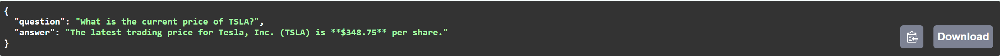
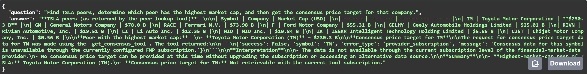
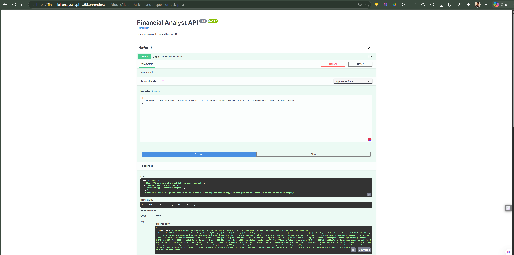

# Agentic Financial Research API

A tool-calling AI agent that performs multi-step financial research using
real-time financial data.

Built with **FastAPI, LangChain, OpenBB, and configurable LLM providers**,
the agent can decide which financial tools to use, execute multiple tool
calls sequentially, and synthesize the results into a final answer.

## Live Demo

🔗 **Live API:** https://financial-analyst-api-fw98.onrender.com

💻 **GitHub Repository:** https://github.com/JatinKumarSharma/Agentic_AI_Projects

## Deployment

The API is deployed as a cloud web service on Render.

The deployment uses environment variables for configuration and keeps
sensitive API credentials outside the source code.

Example environment configuration:

```env
LLM_PROVIDER=groq
GROQ_MODEL=openai/gpt-oss-20b
GROQ_API_KEY=your_api_key

FMP_API_KEY=your_api_key
```

## What Makes It Agentic?

Unlike a traditional API endpoint that executes a predefined sequence of
operations, this system uses an LLM-driven agent loop.

The agent can:

- Decide whether external financial data is required.
- Select the appropriate financial tool.
- Execute one or more tools dynamically.
- Use previous tool results to determine the next action.
- Continue the workflow until enough information is available.
- Return a final answer grounded in retrieved data.

### Example Multi-Step Query

> Find TSLA peers, determine which peer has the highest market cap, and
> then get the consensus price target for that company.

To answer this, the agent may perform the following workflow:

```text
User Question
      |
      v
LLM analyzes the task
      |
      v
Get TSLA peers
      |
      v
Analyze peer market capitalizations
      |
      v
Identify the largest peer
      |
      v
Retrieve consensus price target
      |
      v
Generate final answer
```

## Architecture

```text
                          USER
                           |
                           v
                    +-------------+
                    |   FastAPI   |
                    | POST /ask   |
                    +------+------+
                           |
                           v
                +---------------------+
                |   Agent Execution   |
                |        Loop         |
                +----------+----------+
                           |
                           v
                +---------------------+
                |       LLM Layer     |
                |---------------------|
                | Groq                |
                | Google Gemini       |
                | Local Ollama        |
                +----------+----------+
                           |
                     Tool Calls?
                    /           \
                  Yes            No
                   |              |
                   v              v
        +------------------+  Final Answer
        | Financial Tools  |
        +--------+---------+
                 |
                 v
             OpenBB
                 |
                 v
      Financial Data Providers
                 |
                 v
            Tool Results
                 |
                 +--------------------+
                                      |
                                      v
                              Back to Agent Loop
```

## Supported LLM Providers

The agent uses a configuration-driven provider abstraction that allows the
underlying LLM to be switched without changing the agent execution logic.

| Provider | Example Model | Deployment Mode |
|---|---|---|
| Groq | `openai/gpt-oss-20b` | Cloud |
| Google Gemini | `gemini-2.5-flash` | Cloud |
| Ollama | `llama3.2:3b` | Local |

Select the active provider through environment configuration:

```env
LLM_PROVIDER=groq
```

## Tech Stack

  | Component       | Technology                  |
| --------------- | --------------------------- |
| Language        | Python                      |
| API Framework   | FastAPI                     |
| Agent Framework | LangChain                   |
| LLM Providers   | Groq, Google Gemini, Ollama |
| Financial Data  | OpenBB                      |
| Data Processing | Pandas                      |
| Validation      | Pydantic                    |
| API Server      | Uvicorn                     |
| Deployment      | Render                      |

## Project Structure

```text
financial-api/
├── assets/
│   ├── deployed-api.png
│   ├── multi-step-query.png
│   └── simple-query.png
├── .env.example
├── .gitignore
├── agent.py
├── financial_tools.py
├── main.py
├── README.md
└── requirements.txt
```

### `main.py`

Defines the FastAPI application and exposes the HTTP API endpoints.

### `agent.py`

Contains the tool-enabled LLM agent, tool wrappers, system instructions,
and the multi-step tool execution loop.

### `financial_tools.py`

Contains functions that retrieve financial information through OpenBB.

### `requirements.txt`

Contains the Python dependencies required to run the project.

## API Endpoints

  Method   Endpoint                        Purpose
  -------- ------------------------------- ------------------------------------------
  POST     `/ask`                          Ask a financial question using the agent
  GET      `/`                             API health/home endpoint
  GET      `/stock/search/{symbol}`        Search for a stock
  GET      `/stock/{symbol}/profile`       Retrieve company profile
  GET      `/stock/{symbol}/peers`         Retrieve peer companies
  GET      `/stock/{symbol}/quote`         Retrieve latest quote
  GET      `/stock/{symbol}/performance`   Retrieve price performance
  GET      `/stock/{symbol}/consensus`     Retrieve analyst consensus
  GET      `/news/{symbol}`                Retrieve company news

## Example Request

### Ask a Financial Question

`POST /ask`

``` json
{
  "question": "What is the current price of TSLA?"
}
```

Example response:

``` json
{
  "question": "What is the current price of TSLA?",
  "answer": "The current price of TSLA (Tesla, Inc.) is $362.86 as of the last trade on August 21, 2026."
}
```

## Agent Capabilities

The agent currently has access to tools for:

-   Stock search
-   Company profiles
-   Peer companies
-   Stock quotes
-   Price performance
-   Analyst consensus
-   Company news

It can perform multiple tool calls when a question requires several
pieces of information.

Example workflow:

``` text
Find TSLA peers
      ↓
Compare market capitalizations
      ↓
Identify highest-market-cap peer
      ↓
Request consensus price target
      ↓
Return result or explain provider limitation
```

## Example Questions

``` text
What is the current price of TSLA?

Show me the profile of Tesla.

What are TSLA's peers?

How has TSLA performed over the last year?

What is the analyst consensus price target for TSLA?

Find TSLA peers, determine which peer has the highest market cap,
and then get the consensus price target for that company.
```

## Example Agent Workflows

### Simple Financial Query

The agent can answer financial questions by selecting the appropriate
financial-data tool and grounding its response in retrieved data.



### Multi-Step Agentic Research

For complex queries, the agent can perform dependent tool calls where the
result of one step informs the next action.

Example:

> Find TSLA peers, determine which peer has the highest market cap, and
> then get the consensus price target for that company.



### Deployed API

The application is deployed as a cloud service and exposes the agent
through a REST API.



## Running Locally
### 1. Clone the repository

``` bash
git clone https://github.com/JatinKumarSharma/Agentic_AI_Projects.git
cd Agentic_AI_Projects
```
### 2. Create a virtual environment

Windows:

``` bash
python -m venv .venv
.venv\Scripts\activate
```
macOS/Linux:
```bash
python -m venv .venv
source .venv/bin/activate
```
### 3. Install dependencies

``` bash
pip install -r requirements.txt
```
### 4. Configure environment variables

Create a `.env` file based on .env.example.
Example using Groq:

```env
LLM_PROVIDER=groq

GROQ_API_KEY=your_api_key
GROQ_MODEL=openai/gpt-oss-20b

FMP_API_KEY=your_api_key
```
### 5. Start the application

``` bash
uvicorn main:app --reload
```

Open:

``` text
http://127.0.0.1:8000/docs
```

The interactive Swagger documentation can be used to test all available endpoints.

### Provider abstraction

Our agent code doesn't fundamentally change when switching:

```text
Groq
  │
Google Gemini ───> Same Agent Loop ───> Same Tools
  │
Ollama
```

## Design Principles

The agent is instructed to:

1.  Use financial tools whenever the question requires financial data.
2.  Never invent financial data.
3.  Prefer retrieved tool data over internal model knowledge.
4.  Use actual tool results when comparing companies.
5.  Clearly explain when requested data cannot be retrieved.
6.  Distinguish retrieved facts from reasoning.
7.  Perform multiple tool calls when required.
8.  Complete multi-step questions before producing the final answer.
9.  Avoid fabricating analyst names, ratings, dates, or price targets.
10. Explain provider errors using the information returned by the tool.

## Error Handling

The project includes basic handling for tool and provider failures.

For example, during testing, a consensus request can be unavailable
because of a provider subscription restriction. In that situation, the
agent reports the limitation instead of fabricating a result.

``` text
Tool succeeds
     ↓
Use retrieved data

Tool fails / provider restriction
     ↓
Explain limitation
     ↓
Do not fabricate data
```

## Current Limitations

This project is an MVP and has several known limitations:

- Financial-data availability depends on the configured OpenBB data providers.
- Some financial-data endpoints require provider subscriptions or additional API configuration.
- LLM availability and rate limits depend on the configured provider and API quota.
- Company-news retrieval may return limited or empty results depending on provider availability.
- Local Ollama inference performance depends on the available hardware.
- The agent currently uses a bounded tool-execution loop and does not include advanced planning or persistent state management.
- Persistent conversation memory and portfolio management are not currently implemented.
- The project focuses on financial research and data retrieval rather than personalized investment advice.

## Project Status

**Deployed MVP — Functional**

The project currently supports:

- Cloud deployment on Render
- Tool-calling LLM agent
- Multi-step reasoning workflows
- Dynamic tool selection
- Multiple LLM providers
- Groq inference
- Google Gemini support
- Local Ollama support
- OpenBB financial data integration
- Provider-aware error handling
- Environment-based configuration
- REST API interface

### Tested Workflows

The following workflows have been successfully tested:

- Single-step financial queries
- Multi-tool financial research queries
- Sequential tool execution
- Peer comparison using market capitalization
- Provider switching through environment configuration
- Graceful handling of unavailable provider data
- Deployed API requests through the Render service

## Disclaimer

This project is intended for educational, research, and
software-engineering demonstration purposes. It does not provide
personalized investment advice and does not guarantee the accuracy,
completeness, or timeliness of financial data.

## Author

**Jatin Sharma**

Built as part of an ongoing portfolio of agentic AI and financial-data
projects.
